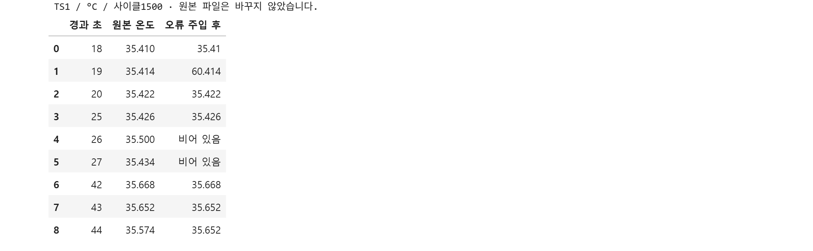
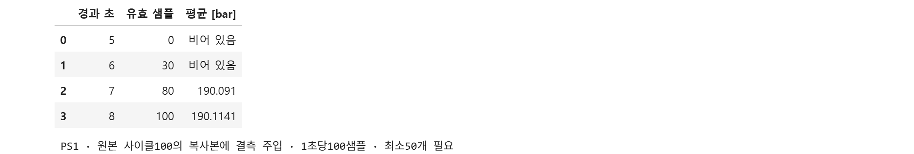
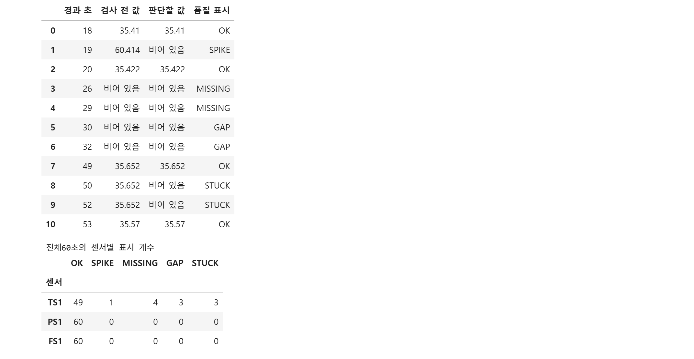
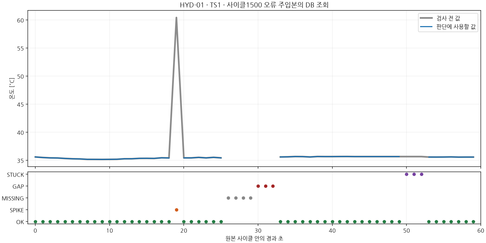
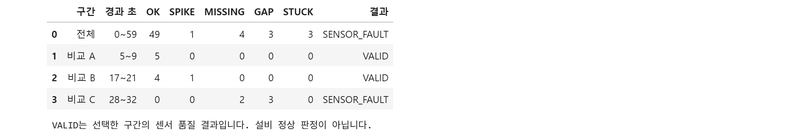
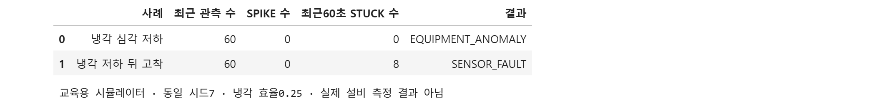

# 2일차 값을 믿기 전에

온도가 갑자기 높아졌습니다. 설비가 뜨거워진 것일 수도 있고 센서가 잘못된 값을 보낸 것일 수도 있습니다. 오늘은 **측정값을 확인한 뒤 설비 상태를 판단하는 순서**를 익힙니다.

코딩 에이전트가 구현하고, 여러분은 입력과 결과를 직접 비교합니다. 실전반은 `quality.py`, 통합반은 `quality_lab.py`를 사용합니다.

## 1. 지난 작업을 다시 열기

첫날에는 값의 설비·센서·단위·원본 위치를 확인했습니다. 오늘은 이 정보에 품질 표시를 더합니다. 먼저 자신의 첫날 작업본과 저장 결과를 다시 엽니다.

> 첫날 작업본을 보존한 채 다시 실행 가능한지 확인해 줘. 내 반의 테스트를 실행하고 단위와 원본 사이클이 남아 있는지 보여 줘. 둘째 날 시작본을 새로운 개인 작업 폴더로 복사하고 제공 플랫폼을 불러오도록 연결해 줘. 아직 둘째 날 실습 코드는 고치지 마.

통합반은 저장했던 센서표·관측 CSV·재생 그래프도 다시 엽니다. 첫날 사이클100~102와 오늘 사용할 사이클1500을 구분하세요. 오늘 오류 주입본은 첫날 CSV를 덮어쓰지 않고 별도로 만듭니다.

첫날 작업본을 잃어버렸다면 강사가 제공한 첫날 완성본을 별도 폴더에서 열어 합류합니다. 이전 작업이 남아 있다면 보존하세요.

## 2. 먼저 값의 모양 보기

**오류 주입**은 원본 복사본의 일부 값을 의도적으로 바꾸어 검사기가 이를 발견하는지 확인하는 것입니다. 실제 원본 파일은 수정하지 않습니다.

> 제공 코드로 사이클1500의 원본 관측과 오류 주입본을 각각 만들어 줘. 검사 결과를 붙이기 전에 온도 TS1의 두 결과를 같은 경과 초로 나란히 보여 줘. 값이 튄 곳, 비어 있는 곳, 같은 값이 반복되는 곳을 찾아볼 수 있게 해 줘. 원본 파일은 바꾸지 마.

노트북에서 실제 과제 코드의 결과를 표로 본 예시입니다. 여러분은 사용하는 코딩 도구에서 같은 항목을 확인하면 됩니다. 19초는 원본35.414°C에25°C를 더한 값이고,26초는 복사본에서 비운 값입니다.43초와44초를 비교해 같은 값 반복이 어디서 시작되는지도 살펴보세요. ‘비어 있음’은0°C가 아닙니다.

세 가지를 구분합니다.

| 모양 | 먼저 확인할 것 |
|---|---|
| 한 번 크게 튄 값 | 앞뒤 값으로 돌아오는가, 높은 수준이 계속되는가 |
| 비어 있는 값 | 몇 초 동안 들어오지 않았는가 |
| 똑같이 반복되는 값 | 같은 값이 몇 번 연속 나왔는가 |

그래프가 평평하다고 바로 안정된 설비라고 판단하지 마세요. 센서가 마지막 값만 반복할 수도 있습니다.

## 3. 검사 요구를 확인하고 구현 맡기기

관측에는 세 정보를 함께 보관합니다.

- `raw_value`: 검사 전 값. 문제가 있어도 원본 근거로 남깁니다.
- `value`: 이번 판단에 사용할 값. 품질 규칙에 걸리면 비워 둡니다.
- `quality_flag`: 왜 사용하거나 보류했는지 나타내는 표시입니다.

| 표시 | 뜻 | 오늘 확인할 기준 |
|---|---|---|
| OK | 제공 품질 규칙을 통과 | 설비 정상 판정을 뜻하지 않음 |
| OUT_OF_RANGE | 값이 설정된 센서 범위를 벗어남 | 제공 센서별 허용 범위 확인 |
| MISSING | 값이 들어오지 않음 | 연속 결측 초반 |
| GAP | 결측이 길어짐 | 연속 결측 5초째부터 |
| STUCK | 같은 값이 오래 반복됨 | 같은 값 8번째부터 |
| SPIKE | 직전 유효값과 차이가 기준을 넘음 | 온도8°C·압력60bar·유량15L/min |

이 수치는 교육용 설정입니다. 다른 설비에 그대로 적용할 실제 운전 기준은 아닙니다. 제공 검사기는 연속된 수준 변화도 구분하므로 값의 차이 하나만으로 최종 결과를 단정하지 않습니다.

**공통 요청**

> 결측을 0이나 마지막 값으로 감추지 않고, 검사 전 값과 판단에 사용할 값을 구분해 보관하고 싶어. 품질 규칙에 걸린 이유도 남겨야 해. 제공 기준과 현재 작업본의 차이를 설명하고, 입력·동작·확인 기준을 짧게 정리해 줘. 내가 뜻을 확인한 뒤 작업본만 수정해 줘.

**실전반은 다음 요구도 확인합니다.**

> 1초 집계에는 실제로 들어온 샘플만 사용하고 유효 개수를 남겨 줘. 필요한 샘플의 절반도 없으면 평균을 만들지 마. 일시적 급등과 계속되는 수준 변화를 구분하고, 센서 품질이 나쁜 구간을 곧바로 설비 이상이라고 판단하지 않게 해 줘. 제공 테스트는 수정하지 마.

실전반의 압력 집계 예시입니다. 여기서는 첫날 사용한 **사이클100의 PS1 복사본**에 결측을 넣습니다.1초에100개 중30개만 남으면 평균을 비우고,80개가 남으면 그80개로 평균을 냅니다. 다른 활동에서 사용하는 사이클1500의 온도 오류와 구분하세요. 입력 숫자를0으로 채운 평균인지, 유효 샘플만 사용한 평균인지 확인합니다.

**통합반은 다음 요구도 확인합니다.**

> 제공 품질 검사기를 사용하도록 RULES의 빈칸을 채워 줘. 최근60초 조회에 quality_flag와 origin_cycle_id가 포함되도록 해 줘. 검사 전 값과 검사 후 값을 함께 읽을 수 있어야 해. 구간 선택은 실제 결과를 본 뒤 정할게. 제공 테스트는 수정하지 마.

## 4. 결과를 보고 이유 설명하기

> 사이클1500 오류 주입본을 검사하고 TS1의 경과 초·검사 전 값·검사 후 값·품질 표시를 보여 줘. 표시별 개수와 표시가 바뀌는 첫 시점을 함께 확인해 줘. 압력과 유량도 따로 확인해 줘.

온도 결과와 비교할 기준입니다.

| 관찰 | 기대 결과 | 이해할 점 |
|---|---|---|
| 19초의 단발 급등 | SPIKE 1개 | 원시 값은 남고 판단용 값은 비어 있음 |
| 26~32초 결측 | MISSING 4개, GAP 3개 | 5초째부터 긴 결측으로 표시 |
| 43~52초 같은 값 반복 | STUCK 3개 | 8번째 반복부터 표시하므로 반복10개와 표시3개는 다름 |
| 나머지 온도 | OK 49개 | 검사 규칙을 통과한 관측 |
| 압력·유량 | 각각 OK 60개 | 이번 오류는 온도 복사본에 주입함 |

“온도60개 중 문제가 있는 값은 몇 개이고, 원시 값은 왜 남겨야 하는가?”를 결과 표에서 확인하세요. 단순히 테스트가 통과했다는 말로 대신하지 않습니다.

19초의60.414와50초의35.652는 검사 전 값에 남고, 판단할 값은 비어 있습니다. 반면26초에는 두 값이 모두 비어 있습니다. **원시값 결측7개와 판단용 값 보류11개가 다른 이유**를 이 열들로 설명해 보세요. 표 위쪽은 선택한 시점만 보여 주며 아래 개수는 전체60초 결과입니다.

회색은 검사 전 값, 파란색은 판단에 사용할 값입니다. 19초의 높은 원시 값은 남아 있지만 파란 선에는 포함되지 않습니다. 아래 표시에서 MISSING이 GAP으로 바뀌는 시점과 STUCK이 시작되는 시점을 찾아보세요. 그래프에서 생긴 빈틈을 선으로 채워 감추지 않습니다.

## 5. DB에서 같은 결과 찾기

파일이나 메모리에서 확인한 결과를 저장한 뒤에도 의미가 유지돼야 합니다. `run_id`는 이번 실행을 다른 실습·시뮬레이터 실행과 구분합니다.

> 내 작업본의 제공 저장 함수를 사용해 새 LAB- 실행으로 검사 결과를 로컬 PostgreSQL에 저장해 줘. 같은 run_id와 설비를 조건으로 다시 읽어, 검사 전 값·검사 후 값·품질 표시·원본 사이클이 보존됐는지 확인해 줘. 다른 실행의 데이터와 섞지 마.

실전반은 온도 원시 값이 비어 있는 행이 결측7개뿐인지 확인합니다. 급등·고착 때의 원시 값까지 지워지면 나중에 판단 이유를 추적할 수 없습니다.

통합반은 온도 최근60초가60행이고 원본 사이클이1500인지 확인합니다. 이어서 온전한 구간과 보류할 구간을 각각5초 이상 선택합니다.

> 내가 선택한 두 구간을 조회해 VALID와 SENSOR_FAULT 중 어떤 결과인지 보여 줘. 전체60초의 판정과 선택 구간의 판정을 구분하고, 어떤 품질 표시가 결과를 결정했는지 설명해 줘. 확인한 구간을 NORMAL_RANGE와 HOLD_RANGE에 반영해 줘.

비교 예시의17~21초는 급등1개를 제외하고4개가 유효해 구간 판정은 `VALID`입니다. 이 표시는 모든 관측이OK라는 뜻도, 설비 정상이라는 뜻도 아닙니다.28~32초는 연속 결측5개가 있어 `SENSOR_FAULT`입니다. 여러분이 선택한 구간의 시작·끝과 품질 분포를 확인한 뒤 결과를 설명하세요.

## 6. 센서 문제와 설비 변화를 구분하기

실전반은 제공 시뮬레이터의 빠른 온도 상승과 높은 온도에서의 고착을 비교합니다.

> 제공 냉각 심각 저하 사례와 그 뒤 센서가 고착되는 사례를 각각 실행해 줘. 빠르게 상승하는 유효 관측을 SPIKE로 지우지 않는지, 높은 값의 고착을 센서 문제로 구분하는지 보여 줘. 같은 시드와 제공 조건을 사용하고 결과를 유리하게 바꾸지 마.

첫 줄은 빠르게 상승해도SPIKE가0개이며 `EQUIPMENT_ANOMALY`로 판정됩니다. 둘째 줄은 최근60초에STUCK8개가 있어 `SENSOR_FAULT`로 판정을 보류합니다. 유효한 고온과 믿기 어려운 고온을 구분하는 예시입니다. 시드7·냉각 효율0.25의 교육용 모델 결과이며 실제 공장 설비의 진단 결과로 해석하지 않습니다.

통합반은 선택한 두 구간의 결과와 온도 오류 주입 전후를 비교합니다. 센서가 끊긴 구간에서는 그 값으로 설비가 회복했는지 판단할 수 없습니다.

**값이 크다는 사실과, 그 값을 판단에 사용할 수 있다는 사실은 다릅니다.** 다음 시간에는 이 관측이 어느 설비의 센서이며 어떤 점검 절차와 연결되는지 확인합니다.

## 7. 저장과 복구

작업 코드와 비교 결과를 저장합니다. 제공 과제가 만든 임시 DB 행을 정리하더라도 비교 결과 파일은 남깁니다. 프로그램이 자기 run을 정리하는 것과 DB 전체를 비우는 것은 다릅니다.

| 막힌 지점 | 에이전트에게 요청할 확인 |
|---|---|
| 제공 모듈을 찾지 못함 | 현재 작업본과 플랫폼코드의 연결 경로 |
| DB 접속 실패 | 로컬 PostgreSQL 상태와 접속 주소 |
| 빈칸 관련 오류 | 어떤 요구가 아직 구현되지 않았는지 설명 후 수정 |
| 개수가 다름 | 같은 센서·사이클·규칙·경과 초를 비교했는지 |
| 모두 정상으로 표시됨 | 결측 대체·품질 필터·원시 값 덮어쓰기 여부 |
| 단발 급등 구간이 VALID | 구간 보류 조건을 확인. SPIKE 한 번과 긴 결측·고착은 다름 |

해결 중에도 원본과 이전 작업은 보존합니다. 에이전트가 수정한 뒤에는 문제가 있었던 입력으로 다시 확인하세요.
