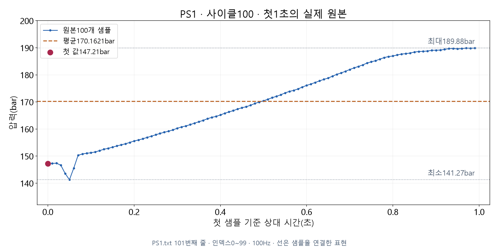

# 같은 구간을 서로 다른 숫자로 설명하기

## S01 첫 1초의 압력은 얼마였을까

**PS1 · 사이클100 · 원본 인덱스0~99 · 100개**

첫 샘플: **147.21bar**

첫 샘플 하나와 그1초 전체를 설명하는 값은 구분합니다.

## S02 실제 원본100개를 함께 본다



처음에 낮아진 뒤 전반적으로 높아집니다. 선은 샘플을 연결한 표현입니다.

## S03 첫 값만 고르면 무엇이 남을까

| 처리 | 입력에 있는 값 | 출력 계산에 쓰는 값 |
|---|---:|---:|
| 시작본의 첫 값 선택 | 100개 | 첫1개 |
| 구간 전체 요약 | 100개 | 전체100개 |

시작본 출력의 `mean`도 **첫 값147.21**입니다.

필드 이름만 보고 실제 평균이라고 판단하지 않습니다.

## S04 평균은 값을 모아 개수로 나눈다

**평균 = 같은 구간의 값 합계 ÷ 사용한 개수**

설명용 숫자 예시: `(2 + 4 + 6) ÷ 3 = 4`

실제 PS1 첫1초: **17,016.21 ÷ 100 = 170.1621bar**

평균이 원본의 특정 샘플과 꼭 같아야 하는 것은 아닙니다.

## S05 첫 값과 평균의 질문이 다르다

| 묻는 내용 | 이 구간의 결과 |
|---|---:|
| 첫 샘플은 얼마인가 | 147.21bar |
| 100개의 평균은 얼마인가 | 170.1621bar |

두 값의 차이: **22.9521bar**

첫 값은 시작 위치를, 평균은 구간 전체를 요약합니다.

## S06 최소와 최대는 관측 범위를 남긴다

| 통계 | 실제 원본에서의 의미 |
|---|---|
| 최소141.27bar | 100개 중 가장 작은 값 |
| 최대189.88bar | 100개 중 가장 큰 값 |
| 차이48.61bar | 최대에서 최소를 뺀 관측 범위의 폭 |

이 숫자들은 **안전 기준이나 허용 한계가 아닙니다.**

## S07 개수는 계산에 참여한 샘플 수다

**n = 요약에 사용한 샘플 수**

| 센서의 첫1초 | 기대되는 원본 개수 |
|---|---:|
| TS1 | 1 |
| FS1 | 10 |
| PS1 | 100 |

PS1에서 n=1이면 첫 값만 선택했는지 확인합니다.

n=100만으로 센서 품질이나 설비 정상을 증명하지는 않습니다.

## S08 요약이 같아도 순서는 다를 수 있다

**설명용 숫자 배열 — 실제 센서 측정값 아님**

| 순서 | 평균 | 최소 | 최대 | 개수 |
|---|---:|---:|---:|---:|
| 1 → 3 → 2 → 4 | 2.5 | 1 | 4 | 4 |
| 4 → 2 → 3 → 1 | 2.5 | 1 | 4 | 4 |

요약 통계만으로 **어느 값이 먼저 나왔는지** 복원할 수 없습니다.

## S09 자세한 변화를 보려면 원본으로 돌아간다

```text
요약값 → 센서PS1 → 사이클100 → 첫1초 → 원본 인덱스0~99
```

센서·원본 사이클·구간·측정 빈도와 원본 파일을 보존합니다.

평균·최소·최대는 원본을 찾는 주소를 대신하지 못합니다.

## S10 같은 통계 규칙을 세 센서에 적용한다

사이클100의 첫1초를 원본에서 계산한 결과입니다.

| 센서 | 첫 값 | 평균 | 최소 | 최대 | n |
|---|---:|---:|---:|---:|---:|
| TS1(°C) | 53.219 | 53.219 | 53.219 | 53.219 | 1 |
| FS1(L/min) | 7.653 | 0.9028 | 0 | 7.653 | 10 |
| PS1(bar) | 147.21 | 170.1621 | 141.27 | 189.88 | 100 |

TS1은 한 개라서 같습니다. 서로 다른 센서의 수치를 단위 없이 비교하지 않습니다.

## S11 결과 이름보다 계산 근거를 확인한다

**에이전트에게 확인할 내용**

- 같은 파일·사이클·1초 구간을 사용했는가?
- 첫 값 선택과 전체 평균을 구분했는가?
- 최소·최대·개수가 원본 묶음과 맞는가?
- 화면의 반올림과 실제 계산값을 구분했는가?

첫 값이 평균보다 크거나 작은 것 자체를 오류로 판단하지 않습니다.

## S12 요약값에 출처를 함께 담는다

**학생의 요청 예시**

사이클100의 PS1 첫1초를 전체100개로 요약해 주세요. 첫 값과 평균·최소·최대·개수를 비교하고 원본 위치도 보여 주세요. 원본 파일은 보존해 주세요.

다음 영상: 값·단위·설비·원본 위치를 함께 담는 **관측 레코드**
