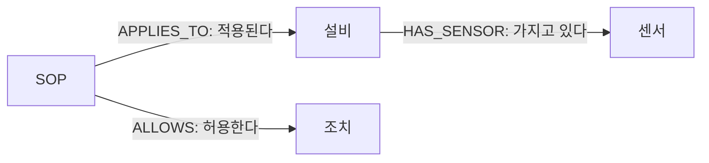
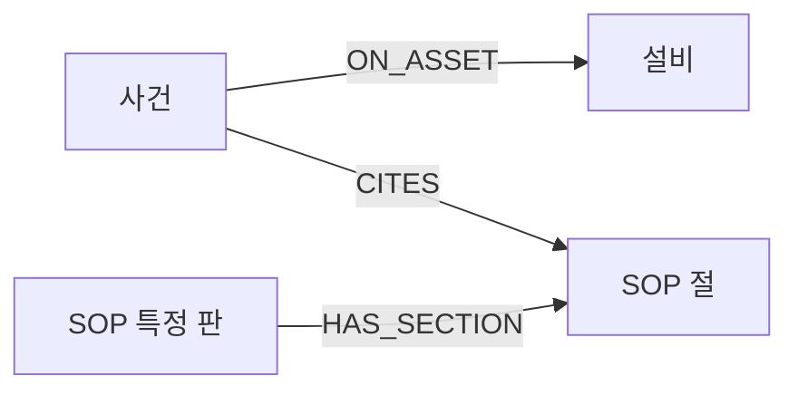

# 관계로 대상과 근거 찾기

## S01 온도를 읽은 다음에 필요한 정보

관측: HYD-01 · TS1 · 53.395°C · 사이클100

**어느 센서인지 알아도 적용할 점검 절차까지 정해진 것은 아닙니다.**

센서의 소속 → 설비의 구성 → 적용 SOP → 허용 조치

## S02 측정 기록과 관계를 함께 읽는다

| PostgreSQL | Neo4j |
|---|---|
| 언제 무엇을 측정했는가 | 무엇이 무엇과 연결되는가 |
| 값·시간·품질·출처 | 설비·센서·SOP·조치 |
| 승인·실행·재측정 이력 | 사건과 설비·인용 절의 연결 |

같은 설비 ID와 센서 코드가 두 저장소를 연결합니다.

## S03 온톨로지는 질문에 답할 구조

업무에 필요한 대상의 종류와 관계를 정합니다.

1. 이 설비의 온도 센서는 무엇인가?
2. 이 설비에 현재 적용되는 절차와 허용 조치는 무엇인가?
3. 이 사건이 인용한 문서의 판과 절은 무엇인가?

**질문 → 필요한 대상 → 관계 → 조회 결과**

## S04 화살표의 주어를 읽는다

관계 이름과 방향이 질문의 뜻을 결정합니다.

## S05 TS1만으로는 센서를 구분할 수 없다

| 설비 | 센서 코드 | 그래프 센서 ID |
|---|---|---|
| HYD-01 | TS1 | HYD-01.TS1 |
| HYD-02 | TS1 | HYD-02.TS1 |
| HYD-03 | TS1 | HYD-03.TS1 |

코드가 같아도 소속 설비가 다르면 다른 센서입니다.

## S06 구체 유형과 공통 분류

| 수업 대상 | 구체 유형 | 공통 분류 |
|---|---|---|
| 유압설비 | Asset | Resource |
| 냉각 구성품 | Component | Resource |
| 온도 센서 | Sensor | Measure |

라벨이 두 개라는 이유로 대상도 두 개가 되는 것은 아닙니다.

## S07 ID가 다르면 새 대상이 된다

`MERGE`: 같은 식별자가 있으면 찾고, 없으면 만듭니다.

| 확인 입력 | 제공 시험 함수의 결과 |
|---|---|
| HYD-01.TS1 | 기존 센서 확인, 새 노드0개 |
| HYD-01-TS1 | 새 노드1개·관계1개 생성 시도, 되돌림 |

이 보호는 제공 함수의 검사 범위에 한정됩니다.

## S08 한 문서의 여러 판을 구분한다

SOP-COOL-001@v2 **active** → 대체한다 → SOP-COOL-001@v1 **superseded**

- 현재 적용 절차: 유효한 판을 선택
- 과거 사건 추적: 당시 인용한 판을 보존

문서 ID만 남기면 어느 판의 판단이었는지 모호해집니다.

## S09 적용 범위는 세 조건으로 좁힌다

**설비 + 사건 유형 + 유효 상태**

| 조건 | 잘못 섞일 수 있는 것 |
|---|---|
| 설비 | 다른 설비의 조치 |
| 사건 유형 | 센서 점검과 냉각 조치 |
| 유효 상태 | 폐기된 절차 |

검색 결과가 많다는 이유로 근거가 충분한 것은 아닙니다.

## S10 같은 냉각 이상에도 조치가 다르다

| 설비 | 냉각 절차 | 허용 설비 조치 |
|---|---|---|
| HYD-01 | SOP-COOL-001 2판 | REDUCE_LOAD: 부하 감소 |
| HYD-02 | SOP-COOL-002 1판 | FAN_BOOST: 팬 증속 |
| HYD-03 | 적용 SOP 없음 | 근거 없는 조치 보류 |

표는 냉각 조치 차이를 보여 줍니다. 재점검·이관 절차는 조회에 함께 나올 수 있습니다.

## S11 빈 결과에는 여러 이유가 있다

| 결과 | 확인할 가능성 |
|---|---|
| 설비 있음, SOP 없음 | 아직 적용 절차를 등록하지 않음 |
| 설비 자체가 없음 | 잘못된 설비 ID |
| 기대한 경로만 없음 | 관계 방향·이름·필터 확인 |

**오류 메시지가 없어도 요구를 만족하지 않을 수 있습니다.**

## S12 문서는 있어도 실행 조치는 없을 수 있다

재점검 SOP → 확인할 관측과 판정 절차

허용 조치 목록 → 비어 있을 수 있음

`OPTIONAL MATCH`는 조치 연결이 없어도 앞에서 찾은 SOP를 남깁니다. 조치가 없다는 이유로 필요한 절차까지 지우지 않습니다.

## S13 관계의 근거도 적용 범위를 확인한다

| 관계의 근거 | 읽는 방법 |
|---|---|
| document | 해당 설비에 적용되는 문서의 설명 |
| simulator_assumption | 교육용 시뮬레이터의 가정 |
| verified_causal=false | 실측 인과 검증을 뜻하지 않음 |

화살표를 그린 사실과 물리적 인과를 입증한 사실을 구분합니다.

## S14 사건의 인용은 문서의 절까지 연결한다

문서 ID + 판 + 절 번호로 판단 근거를 다시 엽니다.

**인용 있음 ≠ 승인 완료 ≠ 조치 성공 ≠ 회복 확인**

## S15 그래프의 센서에 최근 값을 붙인다

1. 그래프에서 HYD-01의 센서 목록 조회
2. 각 센서의 code로 PostgreSQL 관측 조회
3. asset_id·run_id·시간 범위 일치 확인
4. 양쪽 단위와 관측 개수 비교

`HYD-01.TS1`은 그래프 ID, `TS1`은 관측의 센서 코드입니다.

## S16 같은 실행의 결과인지 확인한다

사이클100 실제 조회:

| 센서 | 단위 | 최근 관측 | 마지막 원시 값 |
|---|---|---:|---:|
| FS1 | L/min | 60개 | 7.884 |
| PS1 | bar | 60개 | 147.345 |
| TS1 | °C | 60개 | 53.395 |

현재 제공 품질 기준에서 모두OK60개입니다. 품질OK는 설비 정상 판정이 아닙니다.

## S17 학생은 조회의 요구와 결과를 판단한다

“HYD-02의 현재 냉각 절차를 찾고, 다른 설비·폐기 판은 제외해 주세요. 조치가 없는 관련 절차도 남겨 주세요.”

요구 확인 → 에이전트 구현 → 입력 변경 → 실제 결과 비교

설비를 바꾸었는데 결과가 그대로라면 입력 조건부터 확인합니다.

## S18 관계가 다음 판단의 범위를 정한다

관측의 품질 → 설비·센서 연결 → 지속 이상 탐지 → 적용 SOP 조회

관계는 관측의 소속과 적용할 근거를 정합니다. 다음에는 유효 관측의 변화를 계산해 언제 사건으로 만들지 판단합니다.
